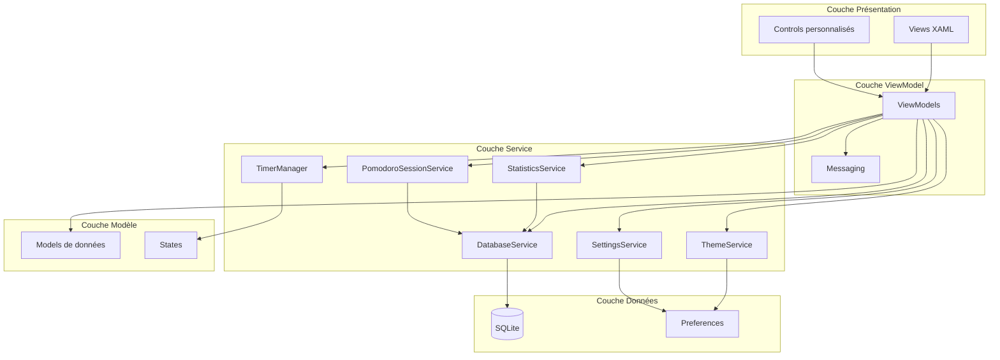
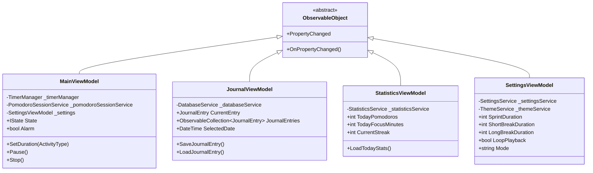
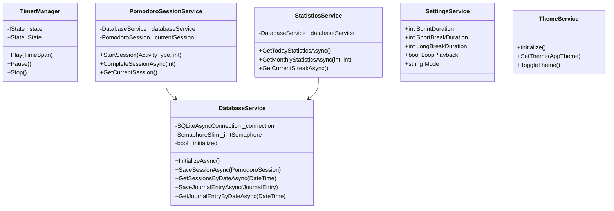
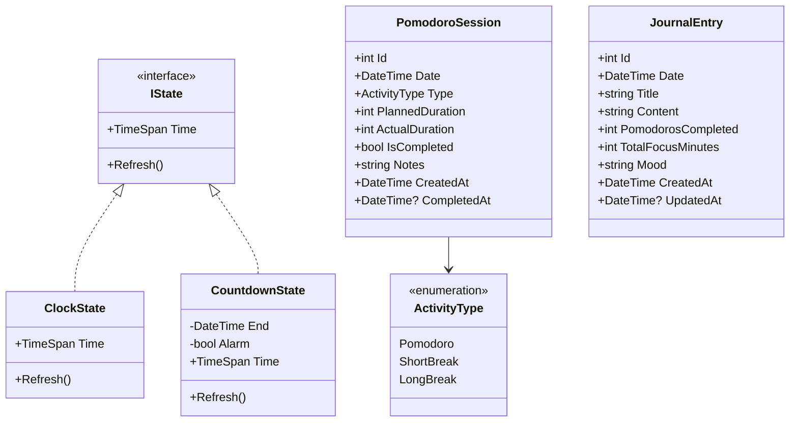
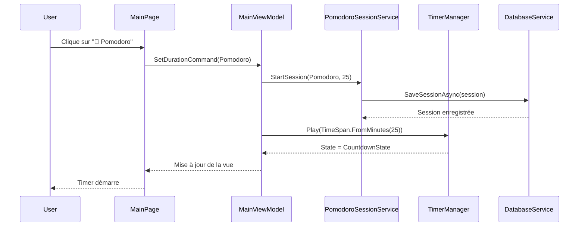
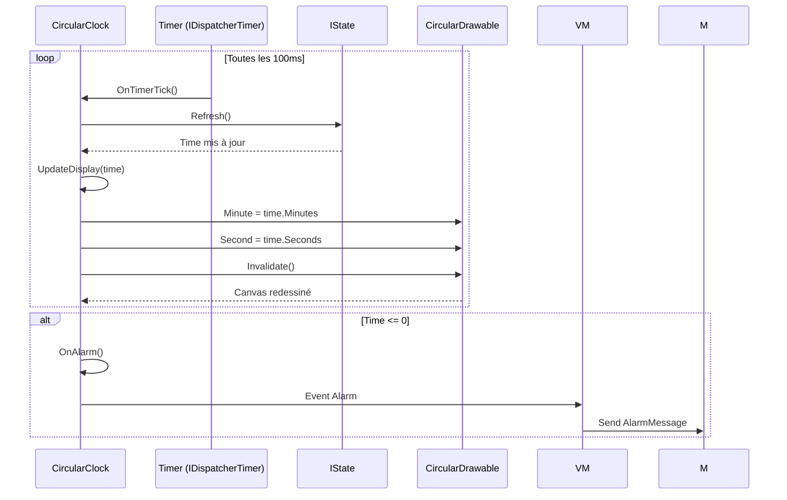
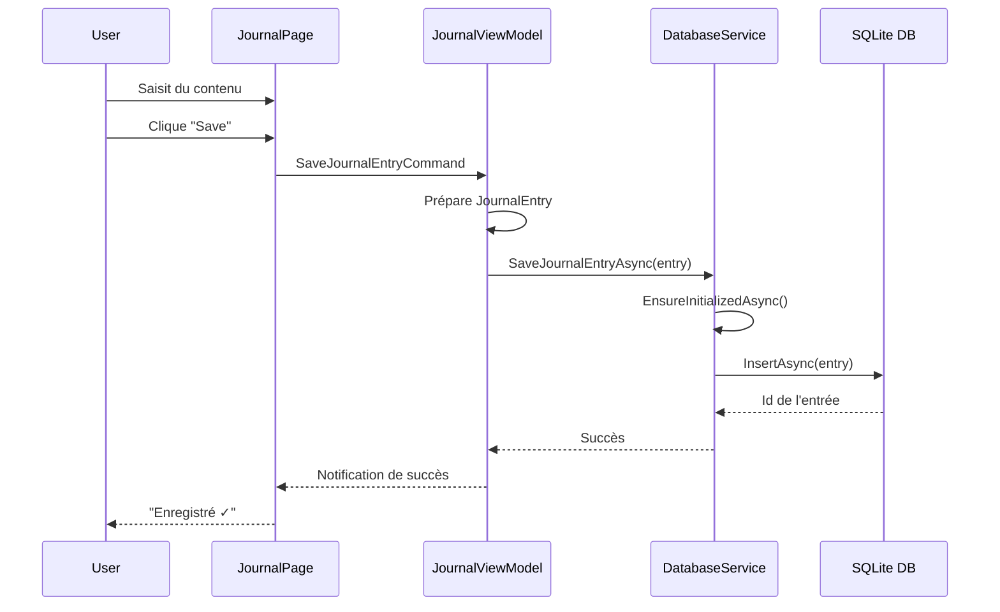
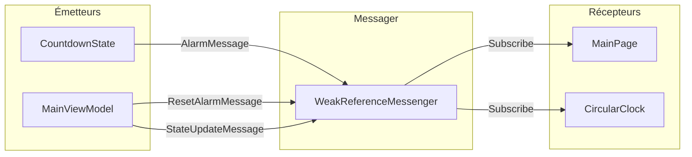
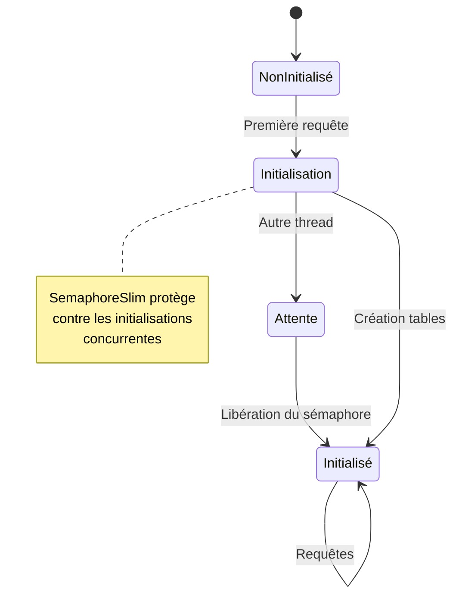

# Architecture de MReveil

## 🏗️ Vue d'ensemble de l'architecture

MReveil suit une architecture en couches basée sur le pattern MVVM (Model-View-ViewModel) avec une injection de dépendances.

## 📦 Composants principaux

### 1. Couche Présentation (Views)

#### Pages principales
- **MainPage** - Page d'accueil avec le timer Pomodoro
- **JournalPage** - Page de journal quotidien
- **StatisticsPage** - Page de statistiques et graphiques
- **SettingsPage** - Page de configuration

#### Contrôles personnalisés
- **CircularClock** - Horloge circulaire animée avec affichage visuel du temps

### 2. Couche ViewModel

### 3. Couche Service

### 4. Couche Modèle

## 🔄 Flux de données

### Démarrage d'une session Pomodoro

### Cycle de rafraîchissement du timer

### Enregistrement d'une entrée de journal

## 🎨 Pattern de communication

### Messaging avec WeakReferenceMessenger

## 🗄️ Gestion de la base de données

### Initialisation lazy et thread-safe

## 🎯 Principes d'architecture

### 1. Séparation des responsabilités
- **Views** : Uniquement l'interface utilisateur
- **ViewModels** : Logique de présentation et état
- **Services** : Logique métier
- **Models** : Données et règles métier

### 2. Injection de dépendances
- Configuration dans `MauiProgram.cs`
- Toutes les dépendances enregistrées comme singletons
- Résolution automatique par le conteneur DI

### 3. Communication découplée
- Messages faibles pour éviter les fuites mémoire
- Événements pour les contrôles
- PropertyChanged pour le binding MVVM

### 4. Gestion asynchrone
- Toutes les opérations de base de données async
- Initialisation lazy pour éviter les blocages
- Dispose pattern pour la libération des ressources

## 🔒 Gestion de la concurrence

- **SemaphoreSlim** pour la synchronisation de l'initialisation DB
- **Task.Run** pour les opérations longues
- **ConfigureAwait(false)** pour éviter les deadlocks (si nécessaire)

## 📊 Performances

### Optimisations
- Timer à 100ms (au lieu de temps réel)
- Invalidation du canvas uniquement si changement
- Initialisation lazy de la base de données
- Requêtes SQLite indexées sur les dates

### Mémoire
- WeakReferenceMessenger pour éviter les fuites
- Dispose pattern sur les contrôles
- Désinscription des événements dans OnUnloaded
