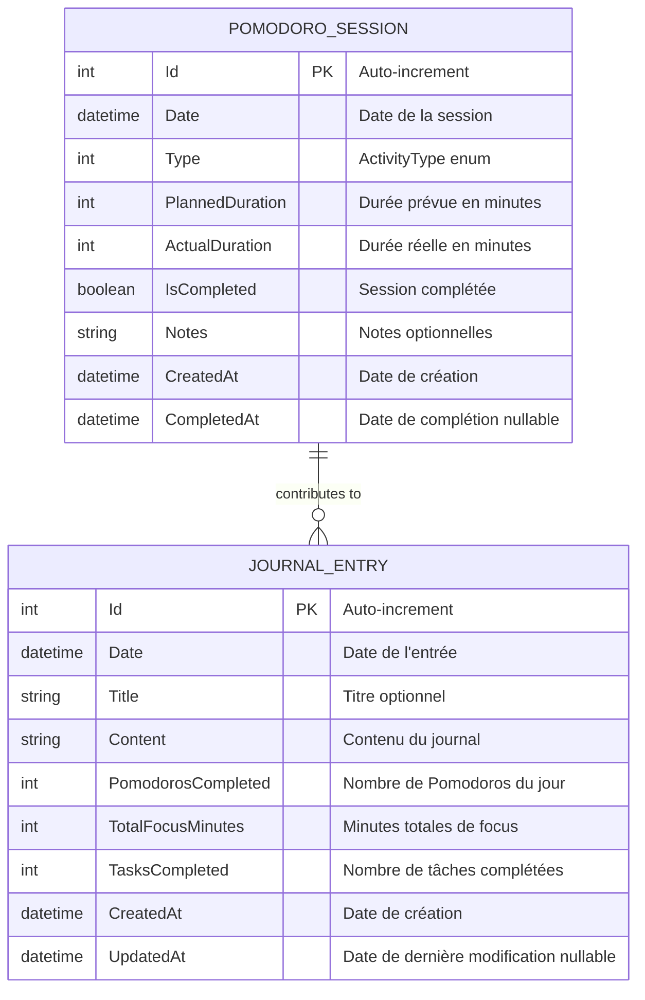
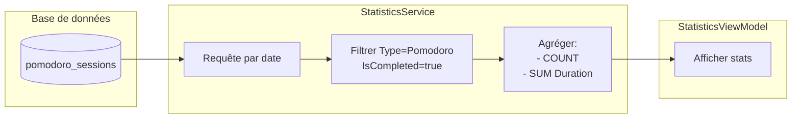

# Modèle de données - MReveil

## 📊 Vue d'ensemble

MReveil utilise SQLite comme base de données locale pour stocker les sessions Pomodoro et les entrées de journal.

## 🗄️ Schéma de base de données



## 📋 Tables détaillées

### Table: `pomodoro_sessions`

Stocke toutes les sessions Pomodoro (travail et pauses).

| Colonne | Type | Contraintes | Description |
|---------|------|-------------|-------------|
| `Id` | INTEGER | PRIMARY KEY, AUTOINCREMENT | Identifiant unique |
| `Date` | DATETIME | NOT NULL, INDEXED | Date et heure de début |
| `Type` | INTEGER | NOT NULL | 0=Pomodoro, 1=ShortBreak, 2=LongBreak |
| `PlannedDuration` | INTEGER | NOT NULL | Durée prévue en minutes |
| `ActualDuration` | INTEGER | NOT NULL | Durée réelle en minutes |
| `IsCompleted` | BOOLEAN | NOT NULL | True si complété, False si abandonné |
| `Notes` | TEXT | | Notes optionnelles |
| `CreatedAt` | DATETIME | NOT NULL | Timestamp de création |
| `CompletedAt` | DATETIME | | Timestamp de complétion |

**Index:**
- `Date` - Pour les requêtes par date

**Exemple de données:**

```sql
INSERT INTO pomodoro_sessions (Date, Type, PlannedDuration, ActualDuration, IsCompleted, Notes, CreatedAt, CompletedAt)
VALUES 
('2024-01-15 09:00:00', 0, 25, 25, 1, 'Préparation de la présentation', '2024-01-15 09:00:00', '2024-01-15 09:25:00'),
('2024-01-15 09:30:00', 1, 5, 5, 1, '', '2024-01-15 09:30:00', '2024-01-15 09:35:00'),
('2024-01-15 09:40:00', 0, 25, 20, 0, 'Interrompu par une réunion', '2024-01-15 09:40:00', NULL);
```

### Table: `journal_entries`

Stocke les entrées de journal quotidiennes.

| Colonne | Type | Contraintes | Description |
|---------|------|-------------|-------------|
| `Id` | INTEGER | PRIMARY KEY, AUTOINCREMENT | Identifiant unique |
| `Date` | DATETIME | NOT NULL, INDEXED | Date du journal (jour) |
| `Title` | TEXT | | Titre optionnel |
| `Content` | TEXT | | Contenu du journal |
| `PomodorosCompleted` | INTEGER | NOT NULL | Nombre de Pomodoros complétés ce jour |
| `TotalFocusMinutes` | INTEGER | NOT NULL | Total de minutes de focus |
| `TasksCompleted` | INTEGER | NOT NULL | Nombre de tâches complétées |
| `CreatedAt` | DATETIME | NOT NULL | Timestamp de création |
| `UpdatedAt` | DATETIME | | Timestamp de dernière modification |

**Index:**
- `Date` - Pour les requêtes par date

**Exemple de données:**

```sql
INSERT INTO journal_entries (Date, Title, Content, PomodorosCompleted, TotalFocusMinutes, TasksCompleted, CreatedAt, UpdatedAt)
VALUES 
('2024-01-15', 'Journée productive', 'J''ai terminé la présentation client et commencé le nouveau projet.', 6, 150, 3, '2024-01-15 18:00:00', '2024-01-15 19:30:00'),
('2024-01-16', '', 'Réunion d''équipe toute la matinée. Peu de temps pour les Pomodoros.', 2, 50, 1, '2024-01-16 17:00:00', NULL);
```

## 🔍 Requêtes principales

### Statistiques du jour

```sql
SELECT 
    COUNT(*) as TotalSessions,
    SUM(CASE WHEN IsCompleted = 1 AND Type = 0 THEN 1 ELSE 0 END) as CompletedPomodoros,
    SUM(CASE WHEN IsCompleted = 1 AND Type = 0 THEN ActualDuration ELSE 0 END) as TotalFocusMinutes
FROM pomodoro_sessions
WHERE DATE(Date) = DATE('now');
```

### Série de jours consécutifs

```sql
WITH RECURSIVE dates AS (
    SELECT DATE('now') as Date
    UNION ALL
    SELECT DATE(Date, '-1 day')
    FROM dates
    LIMIT 365
)
SELECT 
    d.Date,
    COUNT(ps.Id) as SessionCount
FROM dates d
LEFT JOIN pomodoro_sessions ps ON DATE(ps.Date) = d.Date AND ps.IsCompleted = 1 AND ps.Type = 0
GROUP BY d.Date
ORDER BY d.Date DESC;
```

### Sessions d'une période

```sql
SELECT *
FROM pomodoro_sessions
WHERE Date >= :startDate AND Date <= :endDate
ORDER BY Date DESC;
```

### Entrée de journal du jour

```sql
SELECT *
FROM journal_entries
WHERE DATE(Date) = DATE(:selectedDate)
LIMIT 1;
```

## 🎯 Modèles C#

### PomodoroSession.cs

```csharp
[Table("pomodoro_sessions")]
public class PomodoroSession
{
    [PrimaryKey, AutoIncrement]
    public int Id { get; set; }

    [Indexed]
    public DateTime Date { get; set; }

    public ActivityType Type { get; set; }

    public int PlannedDuration { get; set; }

    public int ActualDuration { get; set; }

    public bool IsCompleted { get; set; }

    public string Notes { get; set; } = string.Empty;

    public DateTime CreatedAt { get; set; } = DateTime.Now;

    public DateTime? CompletedAt { get; set; }
}
```

### JournalEntry.cs

```csharp
[Table("journal_entries")]
public class JournalEntry
{
    [PrimaryKey, AutoIncrement]
    public int Id { get; set; }

    [Indexed]
    public DateTime Date { get; set; }

    public string Title { get; set; } = string.Empty;

    public string Content { get; set; } = string.Empty;

    public int PomodorosCompleted { get; set; }

    public int TotalFocusMinutes { get; set; }

    public int TasksCompleted { get; set; }

    public DateTime CreatedAt { get; set; } = DateTime.Now;

    public DateTime? UpdatedAt { get; set; }
}
```

### ActivityType.cs

```csharp
public enum ActivityType
{
    Pomodoro = 0,
    ShortBreak = 1,
    LongBreak = 2
}
```

## 📊 Flux de données

### Cycle de vie d'une session

```mermaid
stateDiagram-v2
    [*] --> Created : StartSession()
    
    state Created {
        note right of Created
            PlannedDuration = durée choisie
            Date = DateTime.Now
            Type = ActivityType
            IsCompleted = false
            CreatedAt = DateTime.Now
        end note
    }
    
    Created --> Saved : SaveSessionAsync()
    
    state Saved {
        [*] --> InDatabase
        note right of InDatabase
            Id attribué par SQLite
            Session en cours
        end note
    }
    
    Saved --> Completed : CompleteSessionAsync()
    
    state Completed {
        note right of Completed
            ActualDuration = durée réelle
            IsCompleted = true
            CompletedAt = DateTime.Now
        end note
    }
    
    Completed --> Updated : UpdateSessionAsync()
    Updated --> [*]
    
    Saved --> Abandoned : Arrêt sans complétion
    Abandoned --> [*]
```

### Agrégation pour les statistiques



## 🔐 Contraintes et validations

### Contraintes de base de données

1. **Unicité:** Pas de contrainte d'unicité sur Date car plusieurs sessions par jour sont possibles
2. **Index:** Date indexée pour optimiser les requêtes temporelles
3. **Clés étrangères:** Non utilisées (pas de relations complexes)

### Validations métier

1. **PomodoroSession:**
   - `PlannedDuration > 0`
   - `ActualDuration >= 0`
   - `CompletedAt` doit être après `CreatedAt` si non-null
   - `Date` ne peut pas être dans le futur

2. **JournalEntry:**
   - Une seule entrée par jour (logique métier, pas contrainte DB)
   - `Date` normalisée au début de la journée (00:00:00)
   - `PomodorosCompleted >= 0`
   - `TotalFocusMinutes >= 0`
   - `TasksCompleted >= 0`

## 📈 Optimisations

### Index

```sql
CREATE INDEX idx_pomodoro_date ON pomodoro_sessions(Date);
CREATE INDEX idx_journal_date ON journal_entries(Date);
```

### Requêtes préparées

Toutes les requêtes utilisent des paramètres pour éviter les injections SQL et améliorer les performances :

```csharp
await _connection.Table<PomodoroSession>()
    .Where(s => s.Date >= startDate && s.Date <= endDate)
    .ToListAsync();
```

## 💾 Stockage

### Localisation du fichier

```
Windows:    C:\Users\{username}\AppData\Local\Packages\{AppId}\LocalState\mreveil.db
Android:    /data/user/0/{PackageId}/files/mreveil.db
iOS:        ~/Library/mreveil.db
macOS:      ~/Library/Containers/{BundleId}/Data/Library/mreveil.db
```

### Taille estimée

- **Session moyenne:** ~200 bytes
- **Journal moyen:** ~500 bytes
- **1 an d'utilisation:** ~5 MB (estimé pour un usage intensif)

## 🔄 Migrations futures

### Version 1.0 → 1.1 (Exemple)

Ajout d'une colonne Tags:

```csharp
public async Task MigrateAsync()
{
    var version = await GetDatabaseVersionAsync();
    
    if (version < 2)
    {
        await _connection.ExecuteAsync(
            "ALTER TABLE pomodoro_sessions ADD COLUMN Tags TEXT");
        await SetDatabaseVersionAsync(2);
    }
}
```

## 📊 Exemples de statistiques calculées

### DailyStats

```csharp
public class DailyStats
{
    public DateTime Date { get; set; }
    public int PomodorosCompleted { get; set; }
    public int TotalFocusMinutes { get; set; }
    public int TotalBreakMinutes { get; set; }
    public double CompletionRate { get; set; } // %
}
```

### MonthlyStats

```csharp
public class MonthlyStats
{
    public int Year { get; set; }
    public int Month { get; set; }
    public int TotalPomodoros { get; set; }
    public int TotalFocusMinutes { get; set; }
    public int AverageDailyPomodoros { get; set; }
    public int BestDay { get; set; }
    public int ActiveDays { get; set; }
}
