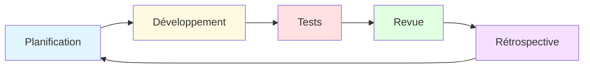
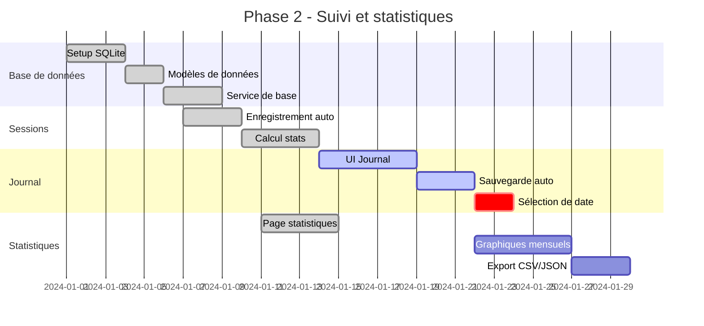
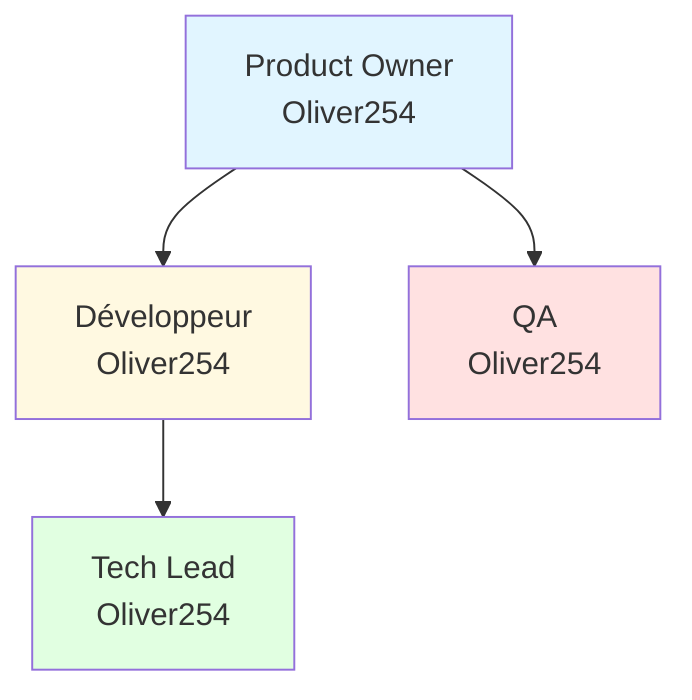
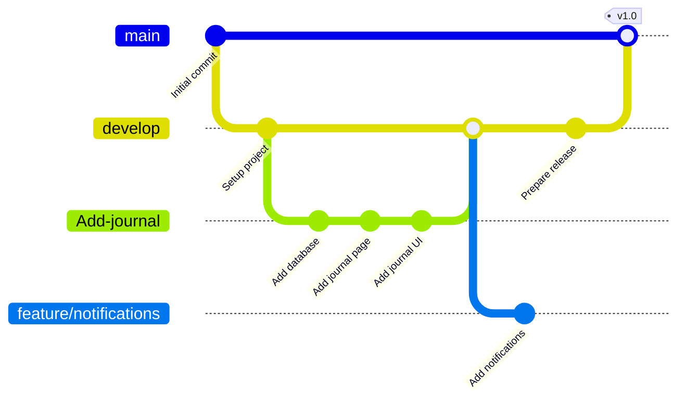
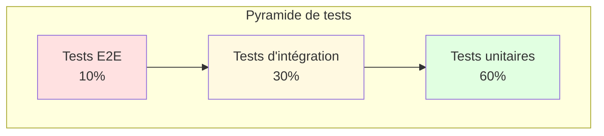
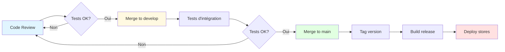

# Gestion de Projet - MReveil

## 📋 Vue d'ensemble du projet

**Nom du projet:** MReveil  
**Type:** Application de productivité multiplateforme  
**Framework:** .NET MAUI 10  
**Statut:** En développement actif  
**Branche actuelle:** Add-journal

## 🎯 Vision et objectifs

### Vision
Créer une application de gestion du temps simple, élégante et efficace basée sur la technique Pomodoro, permettant aux utilisateurs d'améliorer leur productivité tout en maintenant un équilibre entre travail et repos.

### Objectifs principaux
1. **Simplicité d'utilisation** - Interface intuitive et minimaliste
2. **Multiplateforme** - Disponible sur Windows, Android, iOS et macOS
3. **Suivi de productivité** - Statistiques détaillées et journal quotidien
4. **Performance** - Application légère et réactive
5. **Hors ligne** - Fonctionnement complet sans connexion internet

## 📊 Méthodologie de développement

Le projet suit une approche **Agile** avec des sprints de 2 semaines.



## 🗓️ Roadmap du projet

### Phase 1: MVP (Terminée ✅)
**Durée:** 4 semaines  
**Statut:** Complétée

#### Fonctionnalités livrées
- ✅ Timer Pomodoro avec 3 modes (Pomodoro, pause courte, pause longue)
- ✅ Affichage circulaire du temps
- ✅ Notification sonore de fin de session
- ✅ Paramètres personnalisables (durées)
- ✅ Thème clair/sombre

### Phase 2: Suivi et statistiques (En cours 🚧)
**Durée:** 6 semaines  
**Statut:** 75% complété

#### Fonctionnalités en cours
- ✅ Base de données SQLite
- ✅ Enregistrement automatique des sessions
- ✅ Page de statistiques journalières
- ✅ Calcul des séries de jours consécutifs
- 🚧 Page de journal quotidien (en développement)
- ⏳ Graphiques mensuels
- ⏳ Export des données

Le diagramme suivant illustre la progression de cette phase :



### Phase 3: Améliorations UX (Planifiée 📅)
**Durée:** 4 semaines  
**Statut:** Non démarrée

#### Fonctionnalités planifiées
- ⏳ Notifications système
- ⏳ Widgets (iOS, Android)
- ⏳ Raccourcis clavier
- ⏳ Sons personnalisables
- ⏳ Animations améliorées
- ⏳ Mode focus (masquer les distractions)

### Phase 4: Fonctionnalités avancées (Future 🔮)
**Durée:** TBD  
**Statut:** Planification

#### Idées futures
- ⏳ Synchronisation cloud (optionnelle)
- ⏳ Tags et catégories de tâches
- ⏳ Intégration calendrier
- ⏳ Rapports hebdomadaires/mensuels par email
- ⏳ Mode collaboratif (sessions de groupe)

## 📈 Backlog du produit

### Priorité haute (P0) 🔴

| ID | Fonctionnalité | Description | Statut | Points |
|----|----------------|-------------|--------|--------|
| P0-1 | Journal quotidien | Permettre de saisir des notes journalières | 🚧 En cours | 5 |
| P0-2 | Sélection de date | Naviguer dans l'historique du journal | ⏳ À faire | 3 |
| P0-3 | Graphiques mensuels | Visualiser les stats sur un mois | ⏳ À faire | 8 |

### Priorité moyenne (P1) 🟡

| ID | Fonctionnalité | Description | Statut | Points |
|----|----------------|-------------|--------|--------|
| P1-1 | Export de données | Exporter en CSV/JSON | ⏳ À faire | 5 |
| P1-2 | Notifications | Alertes système pour les pauses | ⏳ À faire | 8 |
| P1-3 | Sons personnalisés | Choix de sonneries | ⏳ À faire | 3 |
| P1-4 | Mode focus | Réduire les distractions visuelles | ⏳ À faire | 5 |

### Priorité basse (P2) 🟢

| ID | Fonctionnalité | Description | Statut | Points |
|----|----------------|-------------|--------|--------|
| P2-1 | Tags de tâches | Catégoriser les sessions | ⏳ À faire | 8 |
| P2-2 | Intégration calendrier | Synchroniser avec le calendrier | ⏳ À faire | 13 |
| P2-3 | Widgets | Widgets pour iOS/Android | ⏳ À faire | 13 |
| P2-4 | Sync cloud | Synchronisation optionnelle | ⏳ À faire | 21 |

## 🐛 Gestion des bugs

### Bugs critiques (S0) 🔥
Aucun bug critique actuellement.

### Bugs majeurs (S1) ⚠️

| ID | Description | Statut | Priorité |
|----|-------------|--------|----------|
| B1-1 | Timer ne démarre pas après changement de thème | ⏳ | Haute |

### Bugs mineurs (S2) ℹ️

| ID | Description | Statut | Priorité |
|----|-------------|--------|----------|
| B2-1 | Couleur du texte peu visible en mode sombre | ⏳ | Moyenne |

## 👥 Équipe et rôles

### Équipe actuelle



**Note:** Projet solo actuellement. Ouvert aux contributions.

### Responsabilités
- **Product Owner:** Définition de la vision et des priorités
- **Développeur:** Implémentation des fonctionnalités
- **QA:** Tests et validation
- **Tech Lead:** Architecture et revues de code

## 📝 Processus de développement

### Workflow Git

Le projet utilise le modèle de branches suivant :



### Branches principales
- **main** - Code de production stable
- **develop** - Branche de développement principale
- **feature/** - Nouvelles fonctionnalités
- **bugfix/** - Corrections de bugs
- **hotfix/** - Correctifs urgents en production

### Convention de nommage des branches
- `feature/nom-fonctionnalité` - Nouvelles fonctionnalités
- `bugfix/nom-bug` - Corrections de bugs
- `hotfix/nom-correctif` - Correctifs urgents
- `refactor/nom-refactoring` - Refactoring de code

### Commits
Format des messages de commit selon [Conventional Commits](https://www.conventionalcommits.org/):

```
<type>(<scope>): <description>

[body optionnel]

[footer optionnel]
```

**Types:**
- `feat:` - Nouvelle fonctionnalité
- `fix:` - Correction de bug
- `docs:` - Documentation
- `style:` - Formatage, point-virgules manquants, etc.
- `refactor:` - Refactoring de code
- `test:` - Ajout de tests
- `chore:` - Maintenance

**Exemples:**
```
feat(journal): add daily journal entry page
fix(timer): resolve timer not starting issue
docs(api): update database service documentation
```

## 🧪 Stratégie de tests

### Pyramide de tests

Le projet vise la répartition suivante des tests :



### Couverture de tests

| Couche | Couverture cible | Couverture actuelle |
|--------|------------------|---------------------|
| Services | 80% | 45% |
| ViewModels | 70% | 30% |
| Models | 90% | 60% |
| UI | 50% | 10% |

### Outils de test
- **xUnit** - Framework de tests unitaires
- **Moq** - Mocking pour les dépendances
- **FluentAssertions** - Assertions lisibles
- **Appium** - Tests UI automatisés (planifié)

## 📦 Processus de release

### Versionnement sémantique

Le projet suit [Semantic Versioning 2.0.0](https://semver.org/):

**Format:** MAJOR.MINOR.PATCH

- **MAJOR:** Changements incompatibles
- **MINOR:** Nouvelles fonctionnalités compatibles
- **PATCH:** Corrections de bugs compatibles

### Pipeline de release

Le processus de release suit les étapes suivantes :



### Checklist de release

- [ ] Tous les tests passent
- [ ] Documentation mise à jour
- [ ] CHANGELOG.md mis à jour
- [ ] Version bump dans .csproj
- [ ] Tag Git créé
- [ ] Build de release généré
- [ ] Notes de version rédigées
- [ ] Déploiement sur les stores

## 📊 Métriques du projet

### Vélocité de l'équipe

Suivi des points d'histoire complétés par sprint :

| Sprint | Points planifiés | Points complétés | Vélocité |
|--------|------------------|------------------|----------|
| Sprint 1 | 20 | 18 | 90% |
| Sprint 2 | 21 | 21 | 100% |
| Sprint 3 | 23 | 20 | 87% |
| Sprint 4 | 22 | 19 | 86% |

**Vélocité moyenne:** 20 points/sprint

### Santé du code

| Métrique | Cible | Actuel | Statut |
|----------|-------|--------|--------|
| Couverture de tests | >70% | 45% | 🟡 |
| Dette technique | <5 jours | 3 jours | ✅ |
| Bugs critiques | 0 | 0 | ✅ |
| Temps de build | <2 min | 1.5 min | ✅ |

## 🎯 Définition of Done (DoD)

Une fonctionnalité est considérée comme "Done" quand :

1. ✅ Le code est écrit et fonctionne
2. ✅ Les tests unitaires sont écrits et passent
3. ✅ Le code est documenté (XML comments)
4. ✅ Le code respecte les conventions de style
5. ✅ La revue de code est approuvée
6. ✅ Les tests d'intégration passent
7. ✅ La documentation utilisateur est mise à jour
8. ✅ La fonctionnalité est testée sur toutes les plateformes cibles

## 🔄 Rétrospectives

### Sprint 4 - Rétrospective

**Date:** 15 Janvier 2024

#### Ce qui a bien fonctionné ✅
- Implémentation rapide de la base de données SQLite
- Bonne collaboration entre les différents rôles (même si solo)
- Documentation claire et à jour

#### Ce qui peut être amélioré 🔧
- Augmenter la couverture de tests
- Planifier des sessions de refactoring régulières
- Mieux estimer les tâches complexes

#### Actions pour le prochain sprint 🎯
1. Ajouter des tests unitaires pour DatabaseService
2. Refactorer CircularDrawable pour meilleure maintenabilité
3. Créer des templates de PR avec checklist

## 📞 Communication

### Canaux de communication

- **GitHub Issues** - Bugs et demandes de fonctionnalités
- **GitHub Discussions** - Questions et discussions générales
- **Documentation** - Docs dans /docs
- **Code Reviews** - Pull Requests sur GitHub

### Conventions de communication

1. **Issues:**
   - Titre descriptif et concis
   - Description détaillée avec étapes de reproduction (bugs)
   - Labels appropriés
   - Screenshots si pertinent

2. **Pull Requests:**
   - Titre selon Conventional Commits
   - Description des changements
   - Référence aux issues liées
   - Screenshots pour les changements UI

## 📚 Ressources

### Documentation
- [README principal](./README.md)
- [Architecture](./architecture.md)
- [Diagrammes UML](./uml-diagrams.md)
- [Modèle de données](./data-model.md)

### Outils
- **IDE:** Visual Studio 2022
- **Gestion de version:** Git + GitHub
- **CI/CD:** GitHub Actions (planifié)
- **Gestion de projet:** GitHub Projects

### Formation
- [Documentation .NET MAUI](https://learn.microsoft.com/dotnet/maui/)
- [CommunityToolkit.Mvvm](https://learn.microsoft.com/dotnet/communitytoolkit/mvvm/)
- [SQLite-net](https://github.com/praeclarum/sqlite-net)

## 🎓 Contribution

Le projet est ouvert aux contributions ! Voir [CONTRIBUTING.md](../CONTRIBUTING.md) (à créer) pour les guidelines.

### Comment contribuer
1. Fork le projet
2. Créer une branche feature (`git checkout -b feature/AmazingFeature`)
3. Commit les changements (`git commit -m 'feat: add amazing feature'`)
4. Push vers la branche (`git push origin feature/AmazingFeature`)
5. Ouvrir une Pull Request

---

**Dernière mise à jour:** 15 Janvier 2024  
**Version du document:** 1.0  
**Maintenu par:** Oliver254
