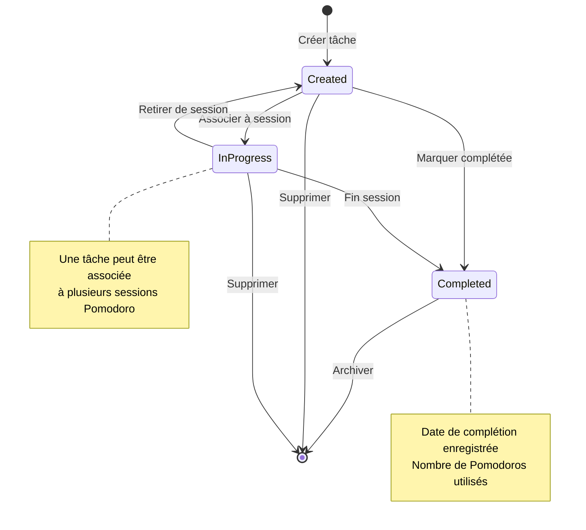
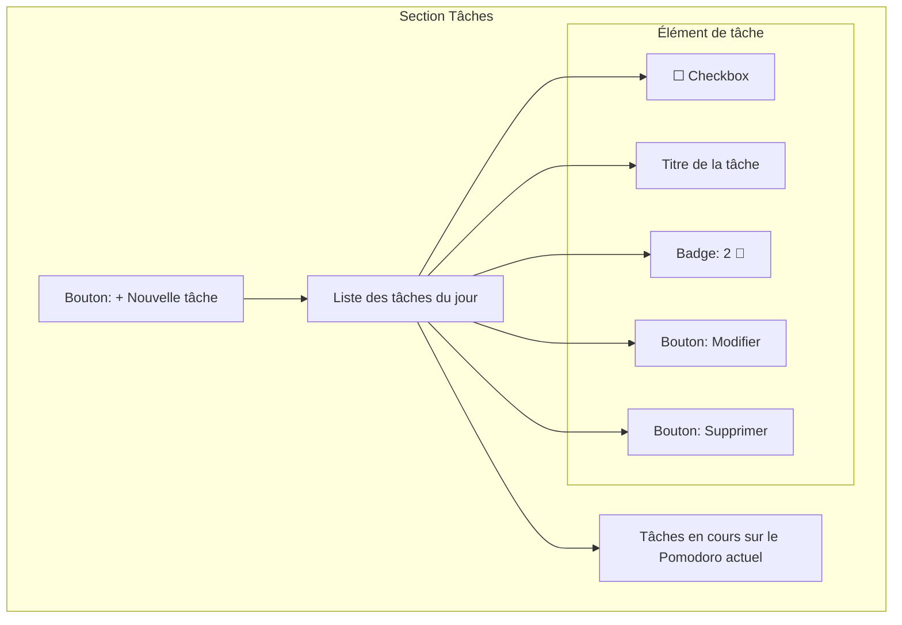
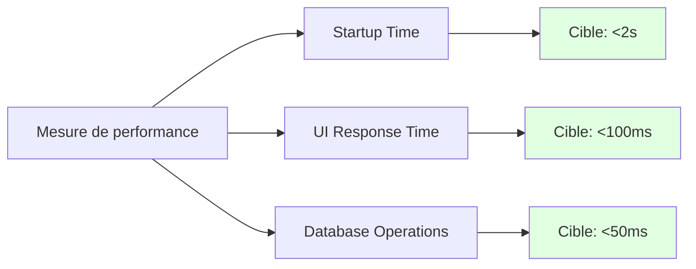
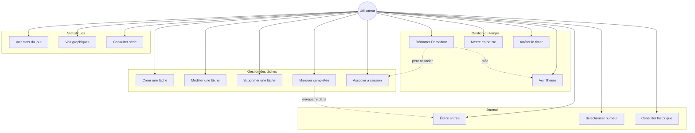
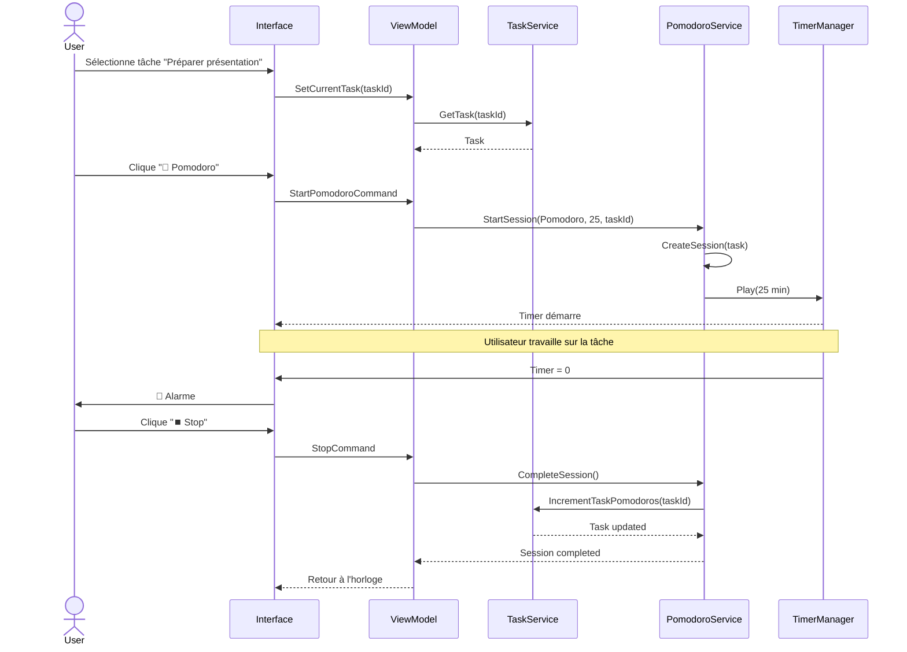
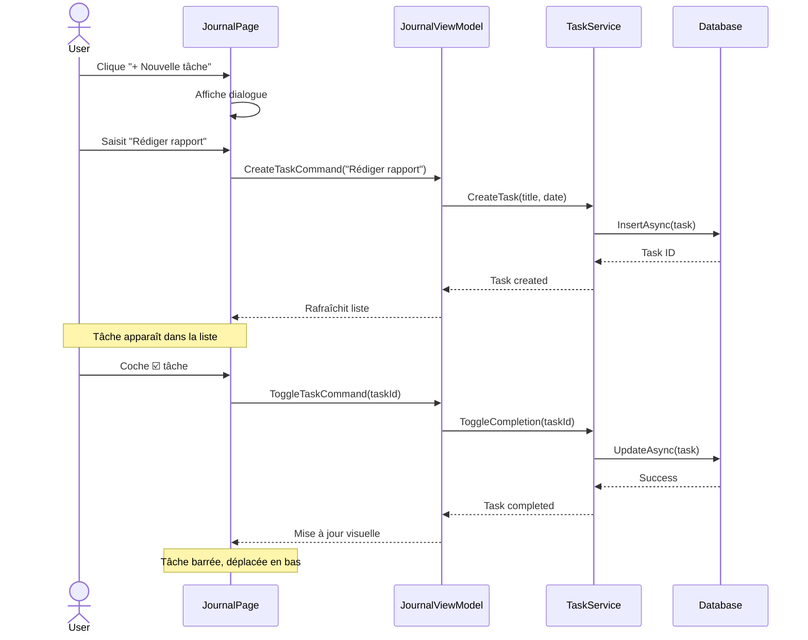
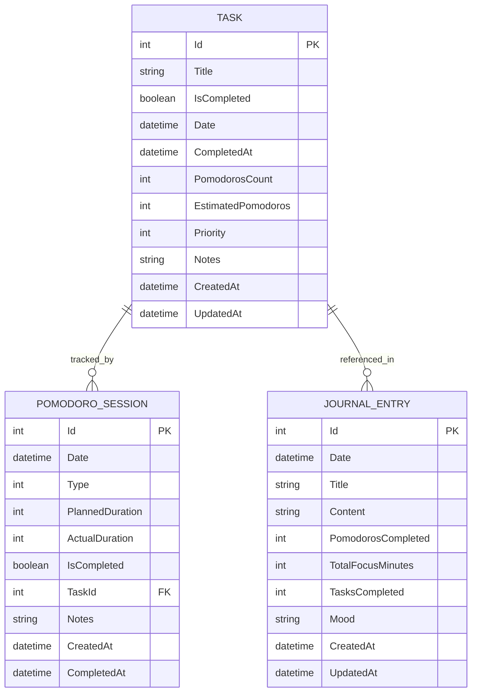
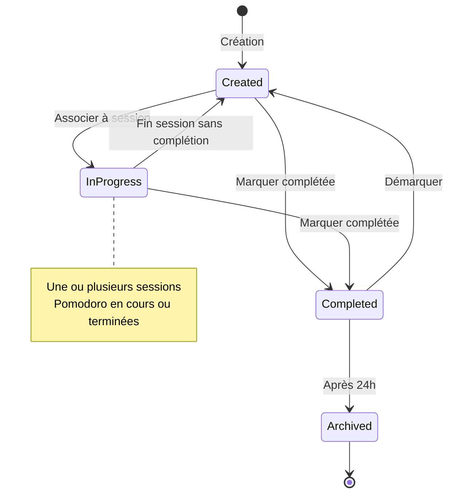
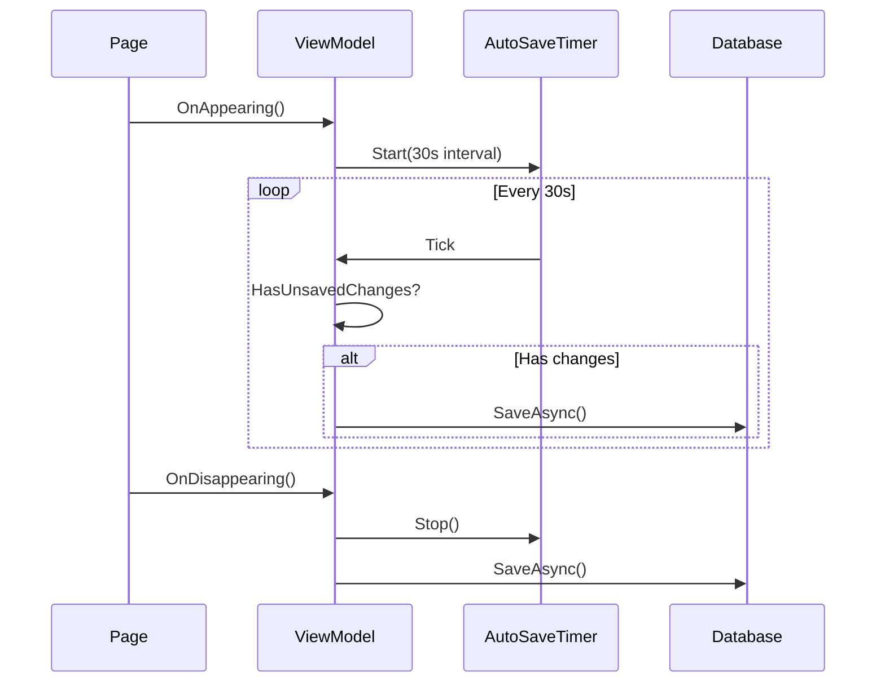

# Spécifications fonctionnelles - MReveil

## 📋 Document de spécifications

**Version:** 2.0  
**Date:** 16 Janvier 2024  
**Auteur:** Oliver254  
**Statut:** En développement

---

## 1. Introduction

### 1.1 Contexte du projet

MReveil est une application de gestion du temps basée sur la technique Pomodoro, permettant aux utilisateurs d'améliorer leur productivité en structurant leur travail en sessions chronométrées avec des pauses régulières.

### 1.2 Objectifs du document

Ce document décrit de manière détaillée les exigences fonctionnelles et non-fonctionnelles de l'application MReveil, ainsi que les règles métier et les contraintes techniques.

### 1.3 Périmètre

L'application couvre :
- Gestion du temps avec technique Pomodoro
- Suivi des sessions de travail
- Gestion de tâches quotidiennes
- Journal quotidien avec réflexions
- Statistiques de productivité

---

## 2. Analyse des besoins

### 2.1 Besoins fonctionnels

#### BF-001: Gestion du timer Pomodoro

**Description:** L'utilisateur doit pouvoir démarrer, mettre en pause et arrêter un timer pour ses sessions de travail et de pause.

**Critères d'acceptation:**
- ✅ Trois types de sessions : Pomodoro (25 min), Pause courte (5 min), Pause longue (15 min)
- ✅ Affichage visuel du temps restant (horloge circulaire)
- ✅ Notification sonore en fin de session
- ✅ Durées personnalisables dans les paramètres

**Priorité:** P0 (Critique)  
**Statut:** ✅ Implémenté

---

#### BF-002: Gestion des tâches

**Description:** L'utilisateur doit pouvoir créer et gérer une liste de tâches à accomplir dans la journée.

**Critères d'acceptation:**
- ✅ Créer une nouvelle tâche avec un titre
- ✅ Marquer une tâche comme complétée
- ✅ Supprimer une tâche
- ✅ Modifier le titre d'une tâche
- ✅ Associer une ou plusieurs tâches à une session Pomodoro en cours
- ✅ Visualiser les tâches en cours pendant le timer
- ✅ Conserver l'historique des tâches complétées

**Règles métier:**



**Priorité:** P0 (Critique)  
**Statut:** 🚧 En développement

**Maquette d'interface:**



---

#### BF-003: Journal quotidien

**Description:** L'utilisateur peut tenir un journal quotidien avec ses réflexions, humeur et tâches accomplies.

**Critères d'acceptation:**
- ✅ Saisir des notes pour chaque jour
- ✅ Sélectionner une humeur (emojis)
- ✅ Visualiser automatiquement les statistiques du jour (Pomodoros, temps de focus)
- ✅ Naviguer entre différentes dates
- ✅ Visualiser les tâches complétées du jour
- ✅ Sauvegarde automatique

**Priorité:** P0 (Critique)  
**Statut:** 🚧 En développement

---

#### BF-004: Enregistrement des sessions

**Description:** Toutes les sessions Pomodoro doivent être automatiquement enregistrées en base de données.

**Critères d'acceptation:**
- ✅ Enregistrement au démarrage d'une session
- ✅ Mise à jour à la fin (durée réelle, complétion)
- ✅ Association aux tâches en cours
- ✅ Persistance locale (SQLite)

**Priorité:** P0 (Critique)  
**Statut:** ✅ Implémenté

---

#### BF-005: Statistiques

**Description:** L'utilisateur peut consulter ses statistiques de productivité.

**Critères d'acceptation:**
- ✅ Nombre de Pomodoros complétés aujourd'hui
- ✅ Temps total de focus aujourd'hui
- ✅ Série de jours consécutifs
- ⏳ Graphiques mensuels
- ⏳ Comparaison avec les semaines précédentes

**Priorité:** P1 (Haute)  
**Statut:** 🚧 En cours (75%)

---

#### BF-006: Paramètres personnalisables

**Description:** L'utilisateur peut personnaliser l'application selon ses préférences.

**Critères d'acceptation:**
- ✅ Modifier les durées des sessions
- ✅ Choisir le thème (clair/sombre)
- ✅ Activer/désactiver la lecture en boucle de l'alarme
- ⏳ Choisir le son d'alarme
- ⏳ Activer les notifications système

**Priorité:** P1 (Haute)  
**Statut:** 🚧 En cours (60%)

---

### 2.2 Besoins non-fonctionnels

#### BNF-001: Performance

**Exigences:**
- Temps de démarrage de l'application < 2 secondes
- Rafraîchissement du timer toutes les 100ms maximum
- Réponse UI instantanée (<100ms)
- Sauvegarde en base de données < 50ms

**Mesure:**


---

#### BNF-002: Fiabilité

**Exigences:**
- Aucune perte de données en cas de crash
- Sauvegarde automatique toutes les 30 secondes
- Initialisation de la base de données thread-safe
- Gestion des erreurs sans crash de l'application

**Contraintes techniques:**
- Utilisation de transactions SQLite
- Gestion des exceptions avec try-catch
- Logging des erreurs critiques

---

#### BNF-003: Utilisabilité

**Exigences:**
- Interface intuitive (pas besoin de formation)
- Navigation claire entre les pages
- Feedback visuel pour chaque action
- Support du mode clair et sombre
- Accessibilité (tailles de police, contrastes)

---

#### BNF-004: Compatibilité

**Exigences:**
- Windows 10/11 (10.0.19041.0+)
- Android 7.0+ (API 24+)
- iOS 15.0+
- macOS 12.0+ (Catalyst)

---

#### BNF-005: Sécurité et confidentialité

**Exigences:**
- Stockage local uniquement (pas de cloud par défaut)
- Aucune télémétrie personnelle
- Pas d'accès réseau requis
- Données chiffrées sur l'appareil (future version)

---

#### BNF-006: Maintenabilité

**Exigences:**
- Code documenté (XML comments)
- Architecture MVVM stricte
- Tests unitaires (couverture >70%)
- Documentation technique complète

---

## 3. Modélisation des exigences

### 3.1 Cas d'utilisation principaux



### 3.2 Scénarios d'interactions

#### Scénario 1: Session Pomodoro avec tâche

**Acteur:** Utilisateur  
**Préconditions:** L'application est ouverte, au moins une tâche existe  
**Déclencheur:** L'utilisateur veut travailler sur une tâche

**Flux principal:**



**Postconditions:**
- Session enregistrée avec la tâche associée
- Compteur de Pomodoros de la tâche incrémenté
- Statistiques du jour mises à jour

---

#### Scénario 2: Gestion des tâches quotidiennes

**Acteur:** Utilisateur  
**Préconditions:** Page Journal ouverte  
**Déclencheur:** L'utilisateur veut organiser sa journée

**Flux principal:**



---

### 3.3 Maquettes d'interface

#### Maquette: Page Journal avec tâches

```
┌─────────────────────────────────────────────┐
│  📔 Journal                                 │
│  Reflect on your day                        │
├─────────────────────────────────────────────┤
│                                             │
│  📅  Jan 16, 2024              [Load]      │
│                                             │
│  ┌───────────────────────────────────────┐ │
│  │ 🍅 Pomodoros          ⏱️ Focus Time   │ │
│  │      4                    100 min      │ │
│  └───────────────────────────────────────┘ │
│                                             │
│  📝 Tasks for today                         │
│  ┌───────────────────────────────────────┐ │
│  │ [+] Add new task                      │ │
│  └───────────────────────────────────────┘ │
│                                             │
│  ☐ Préparer présentation client      2🍅   │
│     [Edit] [Delete] [▶️ Start]              │
│                                             │
│  ☑️ Rédiger rapport mensuel          3🍅   │
│     [Edit] [Delete]                         │
│                                             │
│  ┌───────────────────────────────────────┐ │
│  │ 🎯 Current Pomodoro Task:             │ │
│  │    Préparer présentation client       │ │
│  └───────────────────────────────────────┘ │
│                                             │
│  😊 How was your day?                       │
│  [ 😔 ] [ 😐 ] [ 😊 ] [ 🤩 ]               │
│  Selected: 😊                               │
│                                             │
│  ┌───────────────────────────────────────┐ │
│  │ Entry title                           │ │
│  └───────────────────────────────────────┘ │
│                                             │
│  ┌───────────────────────────────────────┐ │
│  │ Write your reflections here...        │ │
│  │                                       │ │
│  │                                       │ │
│  └───────────────────────────────────────┘ │
│                                             │
│  [💾 Save Entry]                            │
│  [🗑️ Delete Entry]                         │
└─────────────────────────────────────────────┘
```

---

## 4. Spécifications détaillées

### 4.1 Modèle de données - Tâches

#### Table: `tasks`

| Colonne | Type | Contraintes | Description |
|---------|------|-------------|-------------|
| `Id` | INTEGER | PRIMARY KEY, AUTOINCREMENT | Identifiant unique |
| `Title` | TEXT | NOT NULL | Titre de la tâche |
| `IsCompleted` | BOOLEAN | NOT NULL, DEFAULT 0 | Tâche complétée ou non |
| `Date` | DATETIME | NOT NULL, INDEXED | Date de la tâche |
| `CompletedAt` | DATETIME | | Date de complétion |
| `PomodorosCount` | INTEGER | NOT NULL, DEFAULT 0 | Nombre de Pomodoros utilisés |
| `EstimatedPomodoros` | INTEGER | DEFAULT 1 | Estimation initiale |
| `Priority` | INTEGER | DEFAULT 0 | Priorité (0=Normal, 1=Haute, 2=Urgente) |
| `Notes` | TEXT | | Notes supplémentaires |
| `CreatedAt` | DATETIME | NOT NULL | Date de création |
| `UpdatedAt` | DATETIME | | Date de dernière modification |

**Diagramme entité-relation:**



---

### 4.2 Règles métier

#### RG-001: Association tâche-session

**Règle:** Une session Pomodoro peut être associée à zéro ou une tâche. Une tâche peut être associée à plusieurs sessions.

**Contraintes:**
- Une session de pause (ShortBreak, LongBreak) ne peut pas avoir de tâche associée
- Seules les sessions de type Pomodoro peuvent avoir une tâche
- Lorsqu'une session avec tâche est complétée, le compteur `PomodorosCount` de la tâche est incrémenté

**Implémentation:**
```csharp
public class PomodoroSession
{
    public int? TaskId { get; set; } // Nullable
    
    public void Complete()
    {
        if (Type == ActivityType.Pomodoro && TaskId.HasValue && IsCompleted)
        {
            // Incrémenter le compteur de la tâche
        }
    }
}
```

---

#### RG-002: Complétion de tâche

**Règle:** Une tâche est considérée comme complétée quand l'utilisateur la marque explicitement comme telle.

**Contraintes:**
- Date de complétion = date/heure actuelle
- Une tâche complétée ne peut plus être modifiée (sauf pour la démarquer)
- Les tâches complétées restent visibles dans la liste du jour
- Après 24h, les tâches complétées peuvent être archivées

**États d'une tâche:**



---

#### RG-003: Affichage des tâches

**Règle:** Les tâches sont affichées par ordre de priorité puis par date de création.

**Ordre d'affichage:**
1. Tâches non complétées, par priorité décroissante
2. Tâches en cours (avec session active)
3. Tâches complétées (barrées, en bas de liste)

**Filtrage:**
- Par défaut: tâches de la date sélectionnée
- Option: afficher toutes les tâches non complétées

---

#### RG-004: Statistiques des tâches

**Règle:** Les statistiques du journal incluent le nombre de tâches complétées.

**Calcul:**
```csharp
public class DailyStats
{
    public int TasksCompleted => Tasks.Count(t => t.IsCompleted);
    public int TasksTotal => Tasks.Count;
    public double CompletionRate => TasksTotal > 0 
        ? (double)TasksCompleted / TasksTotal * 100 
        : 0;
}
```

---

### 4.3 Contraintes techniques

#### CT-001: Gestion de la concurrence

**Problème:** Plusieurs threads peuvent accéder à la base de données simultanément.

**Solution:** Utilisation de `SemaphoreSlim` pour protéger l'initialisation et les écritures critiques.

```csharp
public class DatabaseService
{
    private readonly SemaphoreSlim _writeSemaphore = new(1, 1);
    
    public async Task SaveTaskAsync(Task task)
    {
        await _writeSemaphore.WaitAsync();
        try
        {
            await _connection.InsertOrReplaceAsync(task);
        }
        finally
        {
            _writeSemaphore.Release();
        }
    }
}
```

---

#### CT-002: Performance de la liste de tâches

**Problème:** Liste potentiellement longue de tâches.

**Solution:**
- Virtualisation de la liste (CollectionView)
- Pagination si > 50 tâches
- Index sur la colonne `Date` et `IsCompleted`

---

#### CT-003: Sauvegarde automatique

**Problème:** L'utilisateur peut fermer l'application sans sauvegarder.

**Solution:**
- Sauvegarde automatique toutes les 30 secondes
- Sauvegarde lors de la navigation (OnDisappearing)
- Sauvegarde lors de la mise en arrière-plan



---

### 4.4 Interfaces et API

#### Interface: ITaskService

```csharp
public interface ITaskService
{
    // CRUD de base
    Task<TodoTask> CreateTaskAsync(string title, DateTime date);
    Task<TodoTask> GetTaskAsync(int id);
    Task<List<TodoTask>> GetTasksByDateAsync(DateTime date);
    Task UpdateTaskAsync(TodoTask task);
    Task DeleteTaskAsync(int id);
    
    // Opérations métier
    Task<bool> ToggleCompletionAsync(int id);
    Task IncrementPomodorosAsync(int id);
    Task<TodoTask?> GetCurrentTaskAsync();
    Task SetCurrentTaskAsync(int? taskId);
    
    // Statistiques
    Task<int> GetCompletedTasksCountAsync(DateTime date);
    Task<List<TodoTask>> GetIncompletedTasksAsync();
}
```

---

## 5. Glossaire

| Terme | Définition |
|-------|------------|
| **Pomodoro** | Technique de gestion du temps : 25 minutes de travail concentré |
| **Sprint** | Synonyme de Pomodoro dans le contexte de l'application |
| **Session** | Instance d'un timer (Pomodoro, pause courte, pause longue) |
| **Tâche (Task)** | Unité de travail à accomplir |
| **Journal (Journal Entry)** | Entrée quotidienne avec réflexions et statistiques |
| **Série (Streak)** | Nombre de jours consécutifs avec au moins 1 Pomodoro |
| **Focus Time** | Temps total passé en sessions Pomodoro complétées |

---

## 6. Références

- [Technique Pomodoro](https://francescocirillo.com/pages/pomodoro-technique)
- [UML 2 par la pratique - Pascal Roques](https://www.eyrolles.com/Informatique/Livre/uml-2-par-la-pratique-9782212142679/)
- [Documentation .NET MAUI](https://learn.microsoft.com/dotnet/maui/)
- [Architecture MVVM](https://learn.microsoft.com/dotnet/architecture/maui/mvvm)

---

**Approbation:**

| Rôle | Nom | Date | Signature |
|------|-----|------|-----------|
| Product Owner | Oliver254 | 16/01/2024 | |
| Tech Lead | Oliver254 | 16/01/2024 | |

---

**Historique des versions:**

| Version | Date | Auteur | Changements |
|---------|------|--------|-------------|
| 1.0 | 15/01/2024 | Oliver254 | Version initiale |
| 2.0 | 16/01/2024 | Oliver254 | Ajout gestion des tâches |
