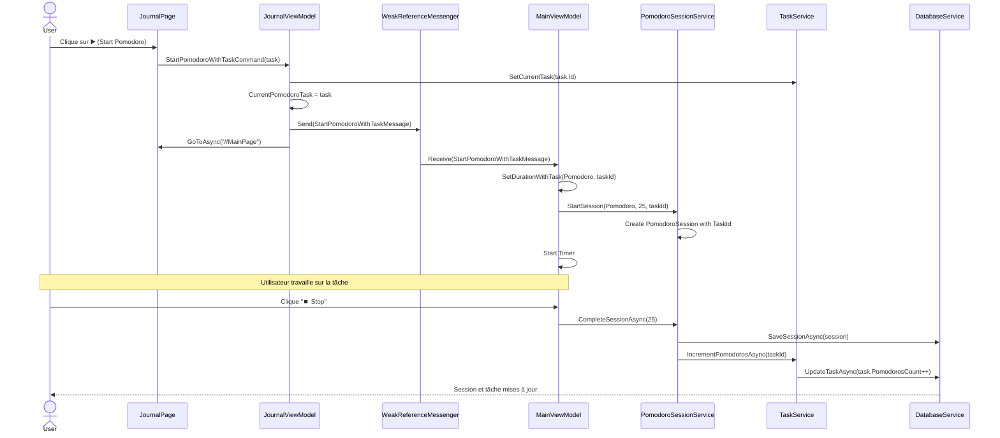

# Guide : Associer une tâche au Pomodoro

## 🎯 Vue d'ensemble

Ce guide explique comment l'association entre une tâche et une session Pomodoro fonctionne dans MReveil.

## 📊 Diagramme de flux



## 🔧 Composants impliqués

### 1. **Interface utilisateur (JournalPage.xaml)**

Chaque tâche a un bouton "▶️" pour démarrer un Pomodoro :

```xaml
<Button Grid.Column="3"
        Text="▶️"
        Command="{Binding StartPomodoroWithTaskCommand}"
        CommandParameter="{Binding .}"
        IsVisible="{Binding IsCompleted, Converter={StaticResource InverseBoolConverter}}"/>
```

**Caractéristiques :**
- Visible uniquement sur les tâches non complétées
- Passe l'objet `TodoTask` complet en paramètre
- Utilise un RelativeSource pour accéder au ViewModel parent

### 2. **ViewModel (JournalViewModel.cs)**

```csharp
[RelayCommand]
public async Task StartPomodoroWithTaskAsync(TodoTask task)
{
    if (task == null)
        return;

    // Définir cette tâche comme tâche courante
    _taskService.SetCurrentTask(task.Id);
    CurrentPomodoroTask = task;

    // Envoyer un message pour démarrer le Pomodoro
    WeakReferenceMessenger.Default.Send(new StartPomodoroWithTaskMessage(task.Id));
    
    // Naviguer vers MainPage
    await Shell.Current.GoToAsync("//MainPage");
}
```

**Responsabilités :**
1. Définir la tâche comme "tâche courante"
2. Mettre à jour `CurrentPomodoroTask` pour l'afficher
3. Envoyer un message pour notifier `MainViewModel`
4. Naviguer vers la page principale

### 3. **Message (StartPomodoroWithTaskMessage.cs)**

```csharp
public class StartPomodoroWithTaskMessage
{
    public int TaskId { get; }

    public StartPomodoroWithTaskMessage(int taskId)
    {
        TaskId = taskId;
    }
}
```

**Pattern de communication :**
- Utilise `WeakReferenceMessenger` pour éviter les fuites mémoire
- Permet la communication entre ViewModels sans couplage direct

### 4. **Réception du message (MainViewModel.cs)**

```csharp
public MainViewModel(...)
{
    // ...
    
    // S'abonner au message
    WeakReferenceMessenger.Default.Register<StartPomodoroWithTaskMessage>(this, (r, m) =>
    {
        SetDurationWithTask(ActivityType.Pomodoro, m.TaskId);
    });
}

private void SetDurationWithTask(ActivityType activityType, int? taskId)
{
    WeakReferenceMessenger.Default.Send(new ResetAlarmMessage(true));
    _currentActivityType = activityType;
    
    int duration = activityType switch
    {
        ActivityType.Pomodoro => Settings.SprintDuration,
        ActivityType.LongBreak => Settings.LongBreakDuration,
        ActivityType.ShortBreak => Settings.ShortBreakDuration,
        _ => 25
    };

    // Démarrer la session avec le taskId
    _pomodoroSessionService.StartSession(activityType, duration, taskId);
    _timerManager.Play(TimeSpan.FromMinutes(duration));
    State = _timerManager.State;
}
```

### 5. **Service de session (PomodoroSessionService.cs)**

```csharp
public void StartSession(ActivityType activityType, int plannedDuration, int? taskId = null)
{
    _currentSession = new PomodoroSession
    {
        Type = activityType,
        Date = DateTime.Now,
        PlannedDuration = plannedDuration,
        ActualDuration = 0,
        IsCompleted = false,
        TaskId = taskId,  // ← Association à la tâche
        CreatedAt = DateTime.Now
    };
}

public async Task CompleteSessionAsync(int actualDuration)
{
    if (_currentSession == null)
        return;

    _currentSession.ActualDuration = actualDuration;
    _currentSession.IsCompleted = true;
    _currentSession.CompletedAt = DateTime.Now;

    await _databaseService.SaveSessionAsync(_currentSession);
    
    // Incrémenter le compteur de Pomodoros de la tâche
    if (_currentSession.TaskId.HasValue && _currentSession.Type == ActivityType.Pomodoro)
    {
        await _taskService.IncrementPomodorosAsync(_currentSession.TaskId.Value);
    }
    
    _currentSession = null;
}
```

**Logique métier :**
1. La session stocke le `TaskId` (nullable)
2. À la complétion, si une tâche est associée ET que c'est un Pomodoro :
   - Le compteur `PomodorosCount` de la tâche est incrémenté
   - Cela crée un historique de combien de Pomodoros ont été utilisés

### 6. **Service de tâches (TaskService.cs)**

```csharp
public async Task IncrementPomodorosAsync(int id)
{
    var task = await GetTaskAsync(id);
    if (task == null)
        return;

    task.PomodorosCount++;
    task.UpdatedAt = DateTime.Now;
    await _databaseService.SaveTaskAsync(task);
}
```

## 📊 Modèle de données

### Table: `pomodoro_sessions`

| Colonne | Type | Description |
|---------|------|-------------|
| Id | INT | Clé primaire |
| Date | DATETIME | Date/heure de début |
| Type | INT | 0=Pomodoro, 1=ShortBreak, 2=LongBreak |
| PlannedDuration | INT | Durée prévue (minutes) |
| ActualDuration | INT | Durée réelle (minutes) |
| IsCompleted | BOOL | Session complétée? |
| **TaskId** | **INT?** | **FK vers tasks (nullable)** |
| CreatedAt | DATETIME | Date de création |
| CompletedAt | DATETIME? | Date de complétion |

### Table: `tasks`

| Colonne | Type | Description |
|---------|------|-------------|
| Id | INT | Clé primaire |
| Title | TEXT | Titre de la tâche |
| IsCompleted | BOOL | Tâche complétée? |
| Date | DATETIME | Date de la tâche |
| **PomodorosCount** | **INT** | **Nombre de Pomodoros utilisés** |
| EstimatedPomodoros | INT | Estimation initiale |
| Priority | INT | Priorité (0-2) |
| Notes | TEXT | Notes supplémentaires |
| CreatedAt | DATETIME | Date de création |
| UpdatedAt | DATETIME? | Date de dernière modification |

## 🔄 Règles métier

### RG-001: Association tâche-session

**Règle :** Une session Pomodoro peut être associée à zéro ou une tâche. Une tâche peut être associée à plusieurs sessions.

**Contraintes :**
- Seules les sessions de type `ActivityType.Pomodoro` peuvent avoir une tâche associée
- Les sessions de pause (ShortBreak, LongBreak) ont toujours `TaskId = null`
- Le compteur est incrémenté uniquement si :
  - `IsCompleted = true`
  - `Type = Pomodoro`
  - `TaskId != null`

### RG-002: Compteur de Pomodoros

**Calcul :** `PomodorosCount` représente le nombre total de sessions Pomodoro complétées pour cette tâche.

**Mise à jour :**
```
À chaque CompleteSessionAsync() :
  SI session.IsCompleted AND session.Type == Pomodoro AND session.TaskId != null
  ALORS task.PomodorosCount += 1
```

### RG-003: Affichage de la tâche courante

**Emplacement :** Section "Current Pomodoro Task" dans JournalPage

**Visibilité :** Visible uniquement si `CurrentPomodoroTask != null`

**Mise à jour :**
- Automatique lors du clic sur ▶️
- Persiste pendant toute la durée de la session
- Se réinitialise à la fin de la session

## 💡 Cas d'usage

### Cas 1: Démarrer un Pomodoro sur une tâche

1. L'utilisateur navigue vers la page Journal
2. Il voit sa liste de tâches du jour
3. Il clique sur ▶️ à côté de "Rédiger rapport"
4. L'application :
   - Marque "Rédiger rapport" comme tâche courante
   - Navigue vers MainPage
   - Démarre un timer de 25 minutes
   - Associe la session à la tâche

### Cas 2: Compléter plusieurs Pomodoros sur la même tâche

```
09:00 - Start Pomodoro "Rédiger rapport" → PomodorosCount = 0
09:25 - Complete → PomodorosCount = 1 ✅
09:30 - Start Pomodoro "Rédiger rapport" → PomodorosCount = 1
09:55 - Complete → PomodorosCount = 2 ✅
10:00 - Start Pomodoro "Rédiger rapport" → PomodorosCount = 2
10:25 - Complete → PomodorosCount = 3 ✅
```

### Cas 3: Consulter l'historique

Dans la page Statistiques, on peut voir :
- Toutes les sessions Pomodoro
- Pour chaque session, la tâche associée (si applicable)
- Le nombre total de Pomodoros par tâche

### Cas 4: Visualiser la tâche en cours sur MainPage

Quand un Pomodoro est démarré avec une tâche associée :

1. L'utilisateur clique sur ▶️ à côté d'une tâche dans JournalPage
2. L'application navigue vers MainPage
3. **Un badge s'affiche sous les boutons de mode** montrant :
   - 🎯 Working on: [Nom de la tâche]
   - Le nombre de Pomodoros déjà complétés
4. Ce badge reste visible pendant toute la session
5. Il disparaît quand l'utilisateur clique sur "⏹️ Stop Timer"

**Affichage visuel :**
```
┌─────────────────────────────────────────┐
│  🍅 Pomodoro  ☕ Short  🏖️ Long        │
├─────────────────────────────────────────┤
│  🎯 Working on:                         │
│  Rédiger rapport                        │
│  2🍅                                    │
└─────────────────────────────────────────┘
│                                         │
│         [Circular Clock]                │
│                                         │
└─────────────────────────────────────────┘
```

## 🎯 Avantages de cette architecture

1. **Traçabilité** : Chaque session est liée à une tâche spécifique
2. **Statistiques riches** : Savoir combien de temps on passe sur chaque tâche
3. **Motivation** : Voir le compteur augmenter encourage à continuer
4. **Historique** : Possibilité d'analyser sa productivité par tâche
5. **Flexibilité** : On peut aussi faire des Pomodoros sans tâche

## 🚀 Utilisation

### Démarrer un Pomodoro avec une tâche

1. Ouvrir la page **Journal**
2. Ajouter une tâche si nécessaire
3. Cliquer sur **▶️** à côté de la tâche
4. Le timer démarre automatiquement sur la page principale
5. Travailler pendant 25 minutes
6. Cliquer sur **⏹️ Stop** quand terminé
7. Le compteur de Pomodoros de la tâche est incrémenté automatiquement

### Démarrer un Pomodoro sans tâche

1. Rester sur la page **Principale**
2. Cliquer sur **🍅 Pomodoro**
3. Le timer démarre sans association à une tâche

## 📝 Notes techniques

- **Pattern utilisé** : Mediator (via WeakReferenceMessenger)
- **Navigation** : Shell-based avec routes absolues
- **Persistance** : SQLite avec ORM sqlite-net-pcl
- **Threading** : Toutes les opérations DB sont async
- **Mémoire** : WeakReference évite les fuites mémoire

---

**Dernière mise à jour :** 16 Janvier 2024  
**Version :** 2.0  
**Auteur :** Oliver254
