# Diagrammes UML - MReveil

Ce document contient tous les diagrammes UML 2 du projet MReveil, créés avec Mermaid.

## 📊 Table des matières

1. [Diagramme de classes](#diagramme-de-classes)
2. [Diagrammes de séquence](#diagrammes-de-séquence)
3. [Diagramme de cas d'utilisation](#diagramme-de-cas-dutilisation)
4. [Diagramme d'états](#diagramme-détats)
5. [Diagramme de composants](#diagramme-de-composants)
6. [Diagramme de déploiement](#diagramme-de-déploiement)
7. [Diagramme d'activités](#diagramme-dactivités)

---

## 1. Diagramme de classes

### 1.1 Vue complète du modèle

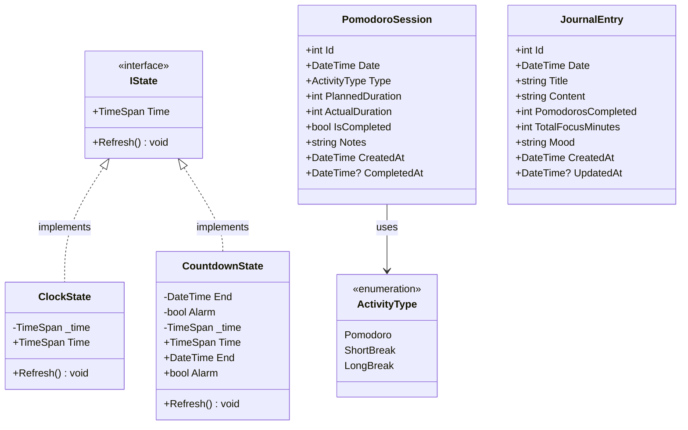

### 1.2 Services

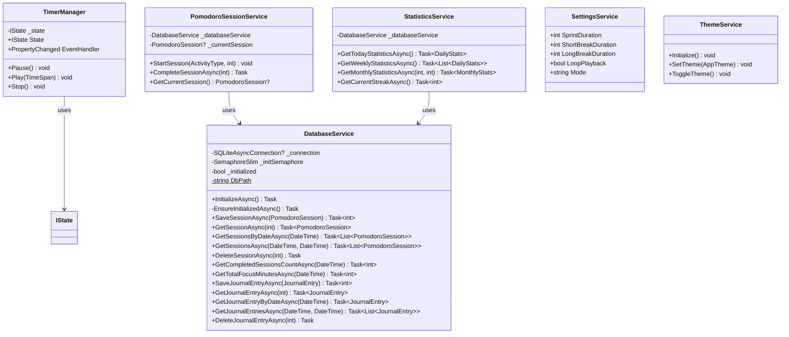

### 1.3 ViewModels

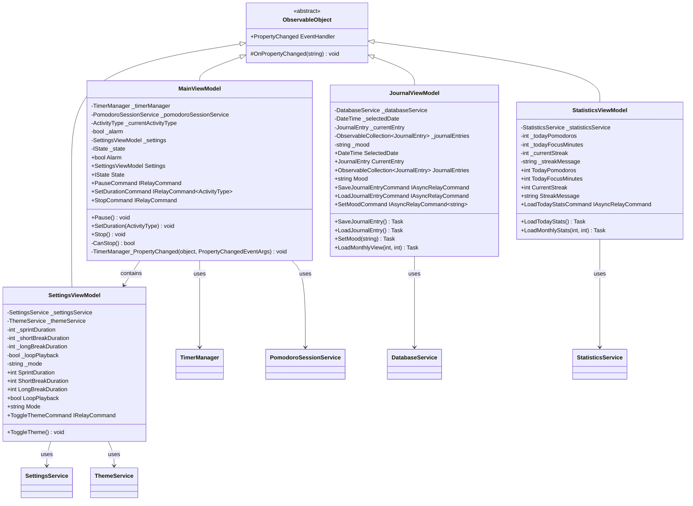

### 1.4 Contrôles et Drawables

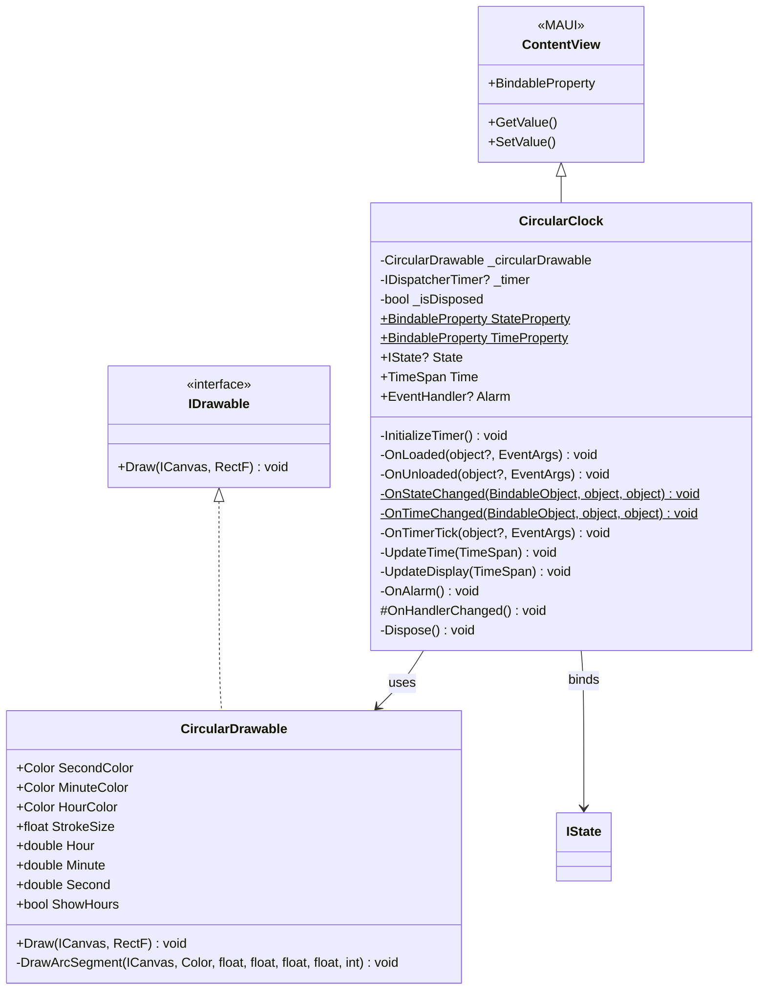

### 1.5 Messages (Messaging Pattern)

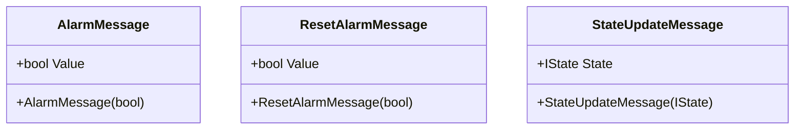

---

## 2. Diagrammes de séquence

### 2.1 Démarrage de l'application

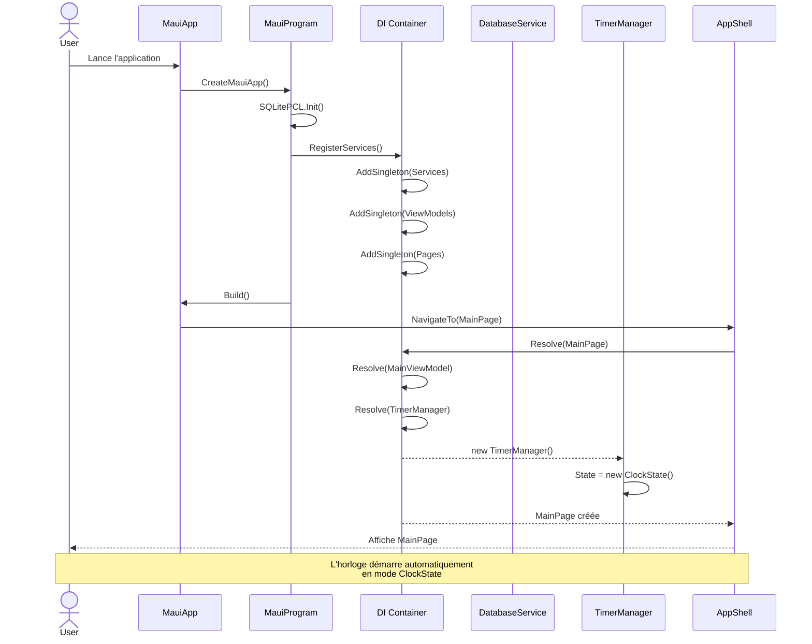

### 2.2 Session Pomodoro complète

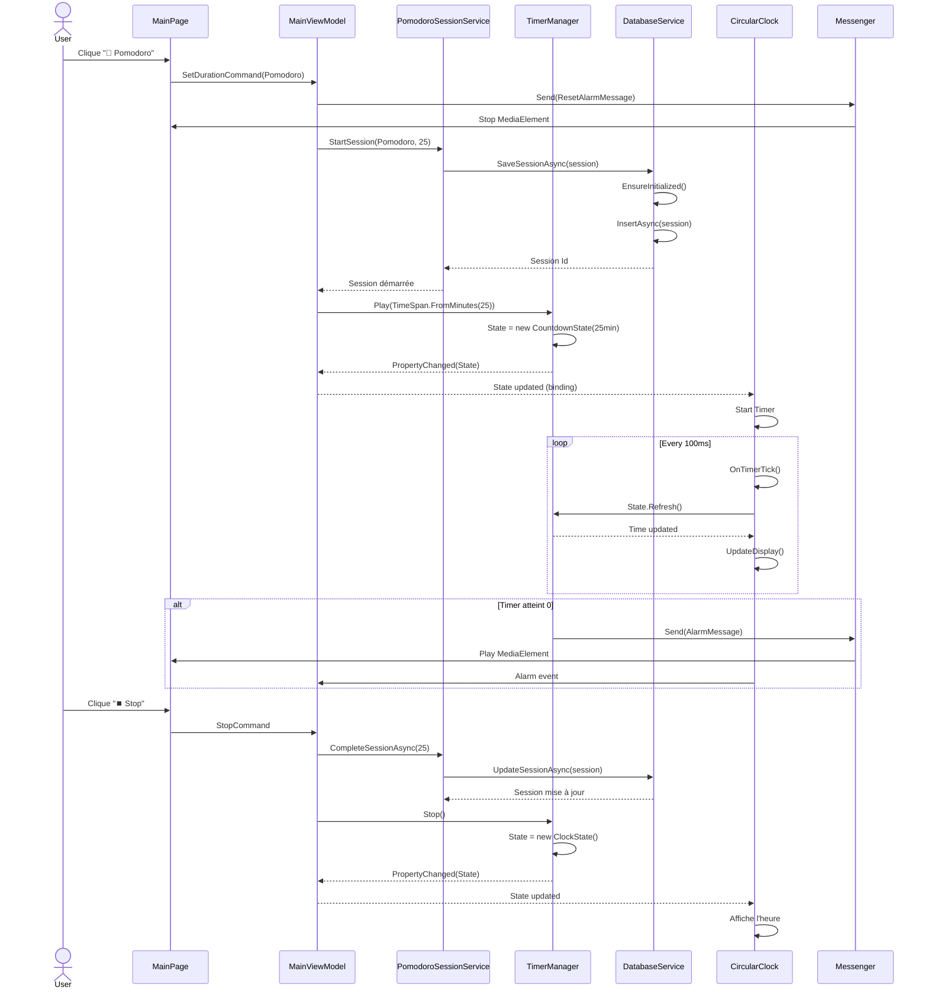

### 2.3 Sauvegarde d'entrée de journal

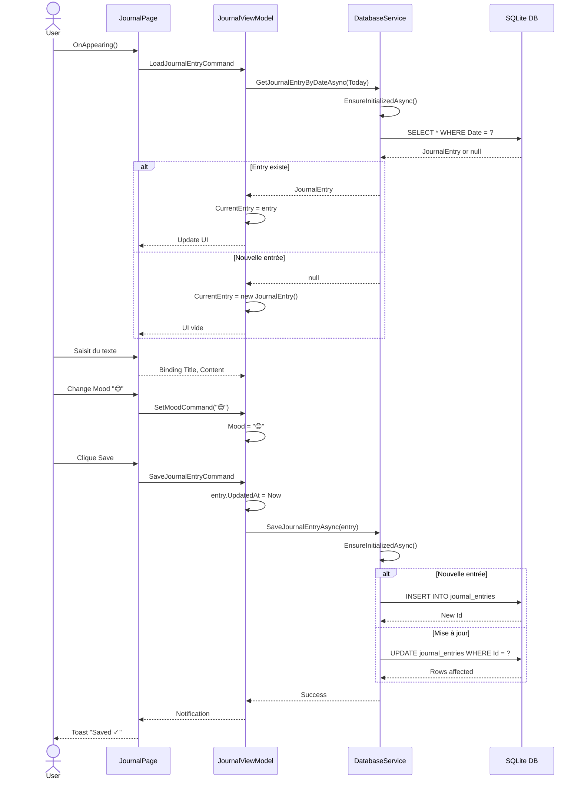

### 2.4 Chargement des statistiques

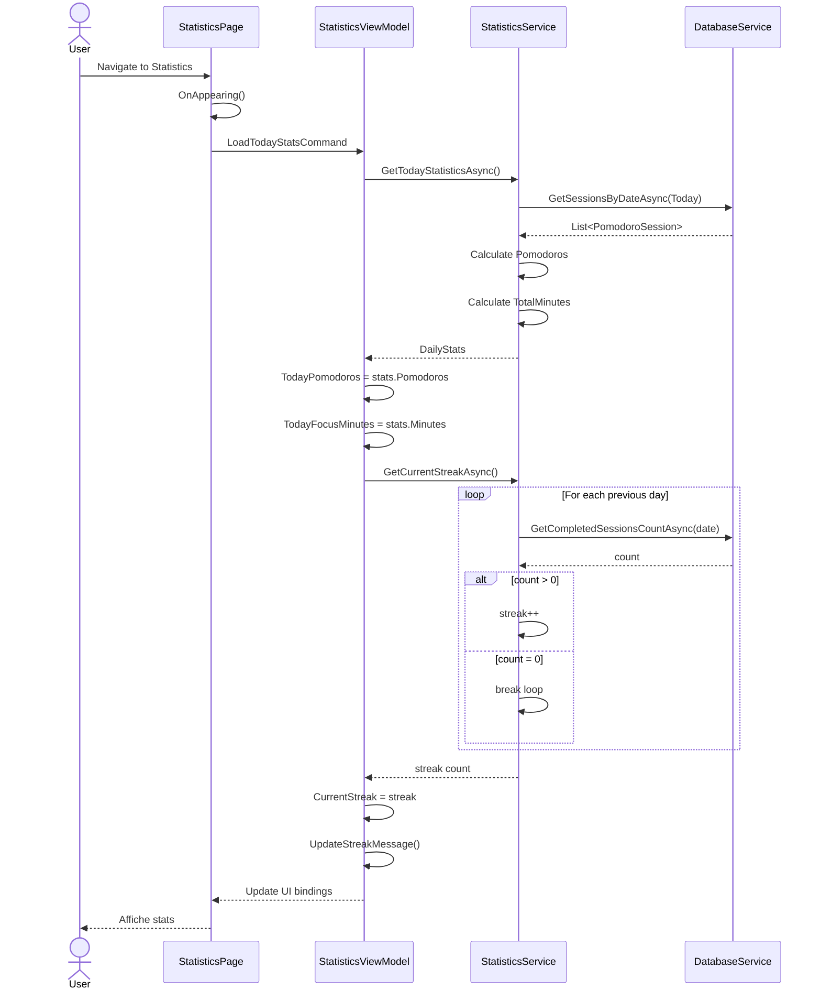

---

## 3. Diagramme de cas d'utilisation

```mermaid
graph TB
    subgraph "Système MReveil"
        UC1[Démarrer un Pomodoro]
        UC2[Mettre en pause le timer]
        UC3[Arrêter le timer]
        UC4[Voir l'heure actuelle]
        UC5[Écrire une entrée de journal]
        UC6[Consulter les statistiques]
        UC7[Modifier les paramètres]
        UC8[Changer le thème]
        UC9[Consulter l'historique]
    end
    
    User((Utilisateur))
    
    User --> UC1
    User --> UC2
    User --> UC3
    User --> UC4
    User --> UC5
    User --> UC6
    User --> UC7
    User --> UC8
    User --> UC9
    
    UC1 -.-> UC3 : extends
    UC2 -.-> UC1 : requires
    UC5 -.-> UC6 : updates
    UC1 -.-> UC9 : creates entry
```

---

## 4. Diagramme d'états

### 4.1 États du Timer

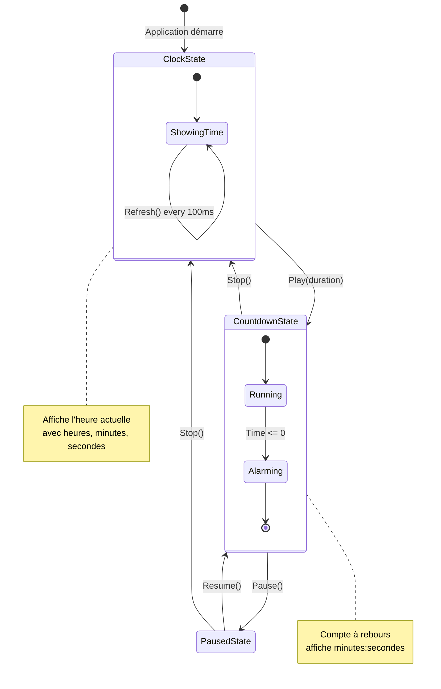

### 4.2 États de la Session Pomodoro

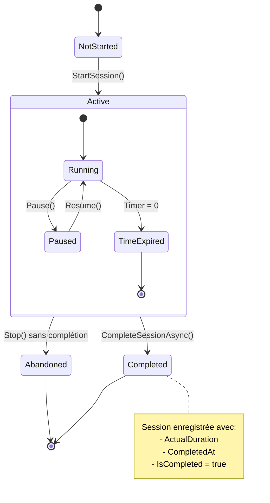

---

## 5. Diagramme de composants

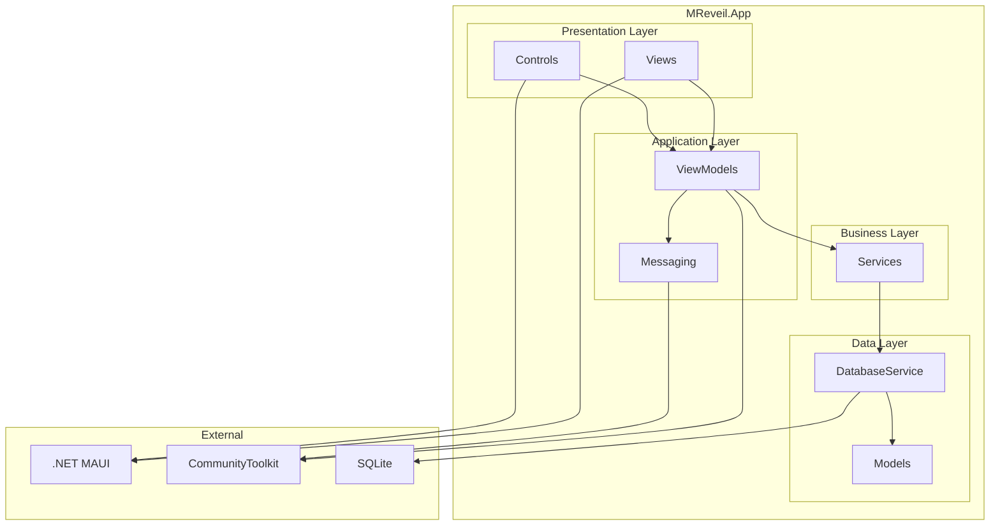

---

## 6. Diagramme de déploiement

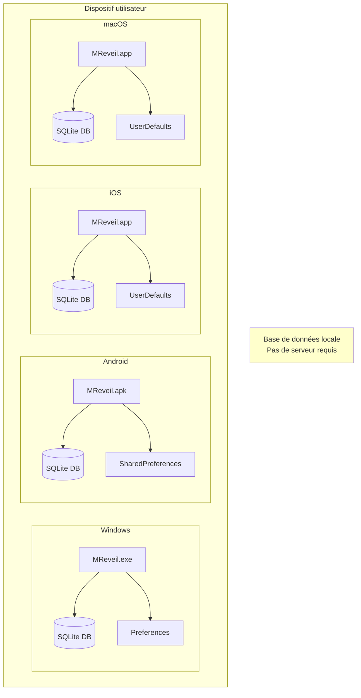

---

## 7. Diagramme d'activités

### 7.1 Processus de session Pomodoro

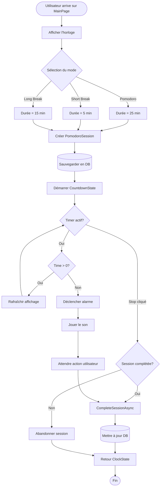

### 7.2 Sauvegarde automatique du journal

```mermaid
flowchart TD
    Start([Édition du journal]) --> TypeText[Utilisateur tape du texte]
    TypeText --> Debounce{Délai écoulé?}
    
    Debounce -->|Non| TypeText
    Debounce -->|Oui| PrepareEntry[Préparer JournalEntry]
    
    PrepareEntry --> SetDate[Date = SelectedDate]
    SetDate --> SetContent[Content = texte saisi]
    SetContent --> SetStats[Stats du jour]
    SetStats --> SetMood[Mood = emoji sélectionné]
    
    SetMood --> CheckExists{Entrée existe?}
    
    CheckExists -->|Oui| UpdateEntry[UpdatedAt = Now]
    CheckExists -->|Non| CreateEntry[CreatedAt = Now]
    
    UpdateEntry --> SaveDB[(Sauvegarder DB)]
    CreateEntry --> SaveDB
    
    SaveDB --> Success{Succès?}
    
    Success -->|Oui| ShowToast[Afficher Toast "Saved"]
    Success -->|Non| ShowError[Afficher erreur]
    
    ShowToast --> End([Fin])
    ShowError --> End
```

---

## 📝 Notes sur les diagrammes

### Conventions utilisées

- **Classes abstraites** : Notation `<<abstract>>`
- **Interfaces** : Notation `<<interface>>`
- **Énumérations** : Notation `<<enumeration>>`
- **Membres statiques** : Suffixe `$`
- **Membres privés** : Préfixe `-`
- **Membres publics** : Préfixe `+`
- **Membres protégés** : Préfixe `#`

### Relations

- `-->` : Dépendance
- `<|--` : Héritage
- `<|..` : Implémentation d'interface
- `*-->` : Composition
- `o-->` : Agrégation

### Stéréotypes personnalisés

- `<<MAUI>>` : Composants du framework MAUI
- `<<Database>>` : Entités de base de données
- `<<Service>>` : Services métier
